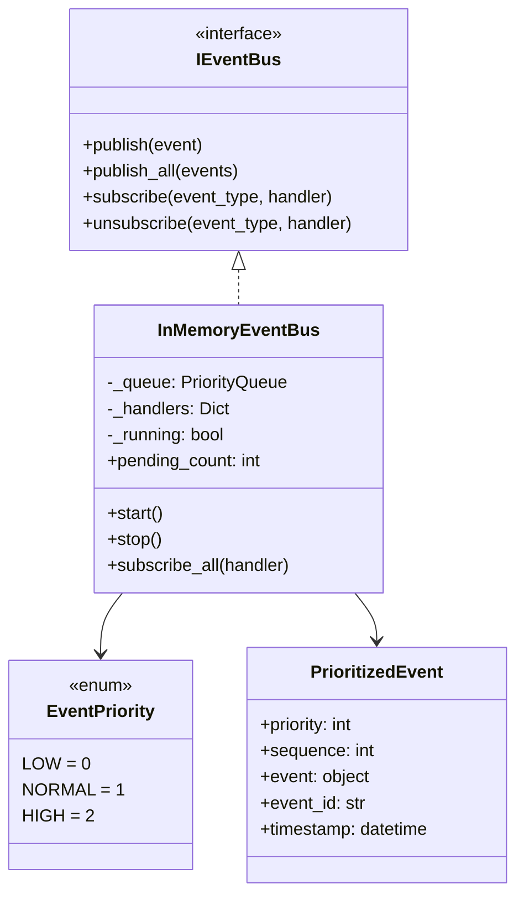
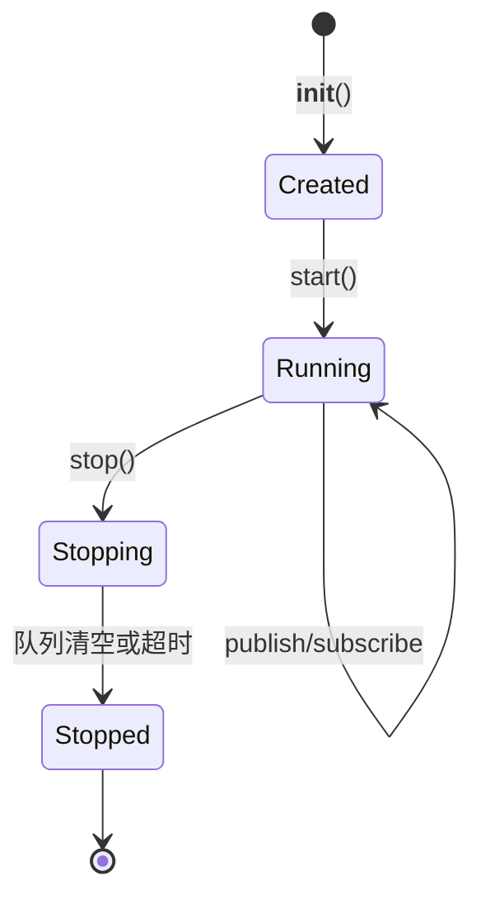
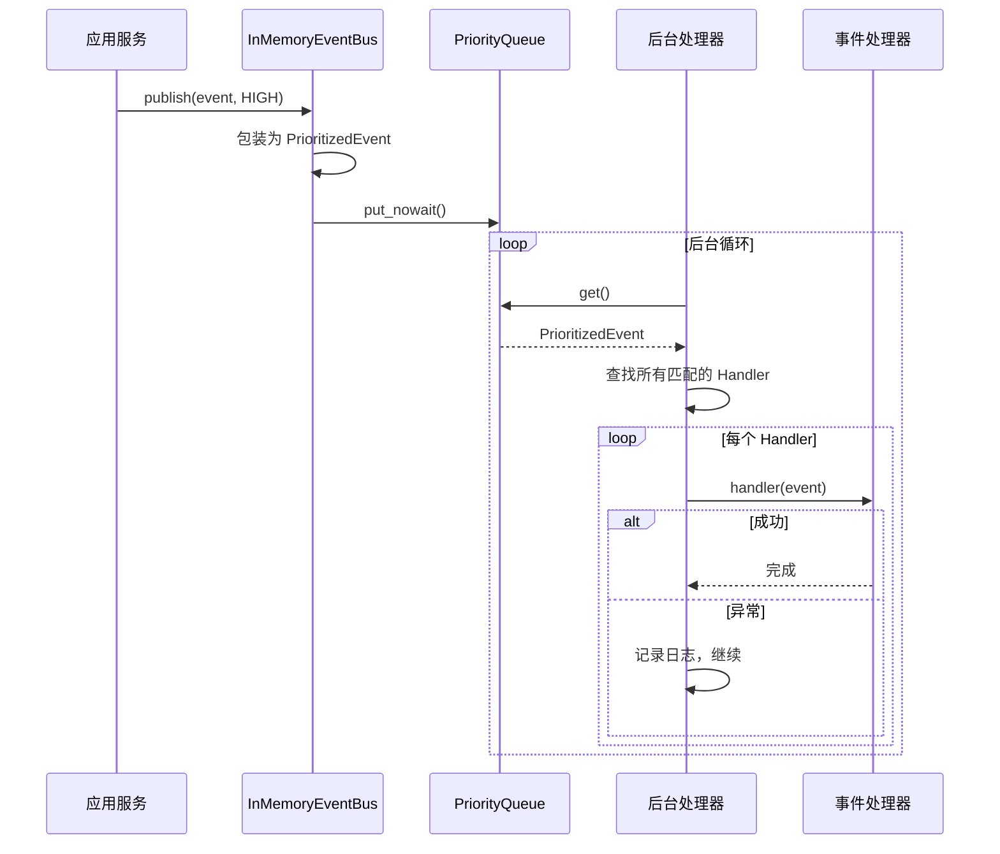

# InMemoryEventBus 内存事件总线 - 技术文档

## 1. 概述

`InMemoryEventBus` 是 HomeTom 智能家居项目的核心基础设施组件，基于 `asyncio.PriorityQueue` 实现，用于解耦限界上下文之间的通信。

### 1.1 设计目标

| 目标 | 说明 |
|------|------|
| **DDD 兼容** | 支持领域事件的发布/订阅模式 |
| **异步处理** | 基于 asyncio，不阻塞主流程 |
| **可扩展** | 接口抽象，可替换为 RabbitMQ/Kafka |
| **高可靠** | 错误隔离，单点故障不影响整体 |

### 1.2 架构位置

```
src/
├── domain/              # 领域层 - 定义领域事件
│   ├── Device/events/
│   ├── Scene/events/
│   └── Execution/events/
├── application/         # 应用层 - 使用事件总线发布事件
│   └── device/DeviceService.py
└── infrastructure/      # 基础设施层 - 事件总线实现
    └── messaging/
        ├── event_bus.py           # IEventBus 接口
        └── in_memory_event_bus.py # 本实现
```

---

## 2. 核心组件

### 2.1 类图



### 2.2 EventPriority 事件优先级

```python
class EventPriority(IntEnum):
    LOW = 0      # 低优先级：日志、统计
    NORMAL = 1   # 普通优先级：默认
    HIGH = 2     # 高优先级：告警、安全相关
```

### 2.3 PrioritizedEvent 事件包装器

每个发布的事件都会被包装为 `PrioritizedEvent`：

| 字段 | 类型 | 说明 |
|------|------|------|
| `priority` | int | 优先级（取负值用于最小堆排序） |
| `sequence` | int | 序列号，保证 FIFO |
| `event` | object | 原始领域事件 |
| `event_id` | str | UUID，用于追踪 |
| `timestamp` | datetime | 发布时间（UTC） |

---

## 3. 生命周期管理

### 3.1 状态流转



### 3.2 启动与关闭

```python
event_bus = InMemoryEventBus(max_queue_size=1000)

# 启动（必须调用，否则事件不会被处理）
await event_bus.start()

# ... 使用 ...

# 优雅关闭（等待队列清空，最多5秒）
await event_bus.stop(timeout=5.0)
```

---

## 4. 发布/订阅模式

### 4.1 订阅事件

```python
# 异步处理器
async def handle_device_registered(event: DeviceRegistered):
    print(f"新设备: {event.name}")

# 同步处理器（也支持）
def log_event(event: DeviceRegistered):
    logger.info(f"设备注册: {event.device_id}")

# 订阅
event_bus.subscribe(DeviceRegistered, handle_device_registered)
event_bus.subscribe(DeviceRegistered, log_event)

# 通配符订阅（接收所有事件）
event_bus.subscribe_all(debug_logger)
```

### 4.2 发布事件

```python
event = DeviceRegistered(
    device_id="dev-001",
    entity_id="light.living_room",
    name="客厅灯",
    manufacturer="Philips",
    adapter_type="http",
    occurred_at=datetime.now(timezone.utc)
)

# 普通优先级
await event_bus.publish(event)

# 高优先级（会优先处理）
await event_bus.publish(event, EventPriority.HIGH)

# 批量发布
await event_bus.publish_all([event1, event2, event3])
```

### 4.3 取消订阅

```python
event_bus.unsubscribe(DeviceRegistered, handle_device_registered)
```

---

## 5. 事件处理流程



---

## 6. 错误处理

### 6.1 Handler 错误隔离

单个 Handler 抛出异常不会影响：
- 其他订阅同一事件的 Handler
- 后续事件的处理

```python
async def faulty_handler(event):
    raise RuntimeError("处理失败")

async def normal_handler(event):
    print("正常处理")

# 两个都订阅
event_bus.subscribe(DeviceRegistered, faulty_handler)
event_bus.subscribe(DeviceRegistered, normal_handler)

# 发布事件
await event_bus.publish(event)
# faulty_handler 失败会被记录，normal_handler 仍会执行
```

### 6.2 队列满处理

```python
# 创建时设置队列大小
event_bus = InMemoryEventBus(max_queue_size=100)

try:
    await event_bus.publish(event)
except asyncio.QueueFull:
    logger.error("事件队列已满，请检查处理器性能")
```

---

## 7. API 参考

### 7.1 InMemoryEventBus

| 方法 | 参数 | 返回值 | 说明 |
|------|------|--------|------|
| `__init__` | `max_queue_size=1000` | - | 初始化 |
| `start` | - | `None` | 启动后台处理器 |
| `stop` | `timeout=5.0` | `None` | 优雅关闭 |
| `publish` | `event`, `priority=NORMAL` | `None` | 发布单个事件 |
| `publish_all` | `events`, `priority=NORMAL` | `None` | 批量发布 |
| `subscribe` | `event_type`, `handler` | `None` | 订阅事件 |
| `unsubscribe` | `event_type`, `handler` | `None` | 取消订阅 |
| `subscribe_all` | `handler` | `None` | 通配符订阅 |
| `clear_handlers` | - | `None` | 清除所有订阅 |
| `wait_until_empty` | `timeout=10.0` | `bool` | 等待队列清空 |

### 7.2 属性

| 属性 | 类型 | 说明 |
|------|------|------|
| `is_running` | `bool` | 是否正在运行 |
| `pending_count` | `int` | 待处理事件数量 |
| `ALL_EVENTS` | `Type` | 通配符类型 |

---

## 8. 最佳实践

### 8.1 在应用服务中使用

```python
class DeviceService:
    def __init__(self, repository, event_bus: IEventBus):
        self._repository = repository
        self._event_bus = event_bus
    
    async def register_device(self, ...):
        device = DeviceAggregate.create(...)
        await self._repository.save(device)
        
        # 发布领域事件
        events = device.get_domain_events()
        await self._event_bus.publish_all(events)
        device.clear_domain_events()
```

### 8.2 Handler 设计建议

1. **保持简短**：复杂逻辑应委托给其他服务
2. **异常处理**：捕获可恢复的异常
3. **幂等性**：设计为可重复执行
4. **避免阻塞**：使用 async/await

---

## 9. 测试

运行验证脚本：

```powershell
cd d:/code/HomeTom
python examples/event_bus_demo.py
```

输出示例：
```
📌 5. 验证处理顺序（高优先级应该先处理）
  预期顺序: dev-003 → dev-002 → dev-001
  实际顺序: dev-003 → dev-002 → dev-001
  ✅ 优先级测试通过！
```

---

## 10. 迁移至 RabbitMQ

由于遵循 `IEventBus` 接口，迁移无需修改业务代码：

```python
# 创建 RabbitMQ 实现
class RabbitMQEventBus(IEventBus):
    async def publish(self, event): ...
    # 实现其他方法

# 依赖注入替换
def create_event_bus():
    if settings.USE_RABBITMQ:
        return RabbitMQEventBus(settings.RABBITMQ_URL)
    return InMemoryEventBus()
```
